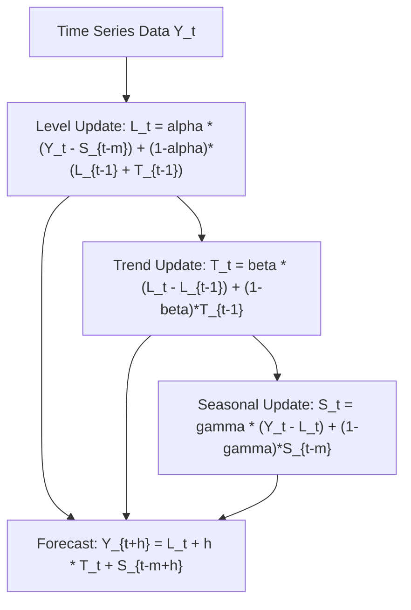

# genpark-holt-winters-exponential-smoothing-skill

Agent Skill implementing **Holt-Winters Additive Triple Exponential Smoothing** for capturing dynamic level, linear trend, and cyclic seasonality in time series.

## Architectural Overview

